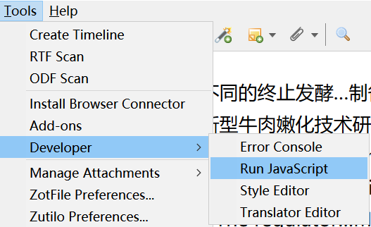
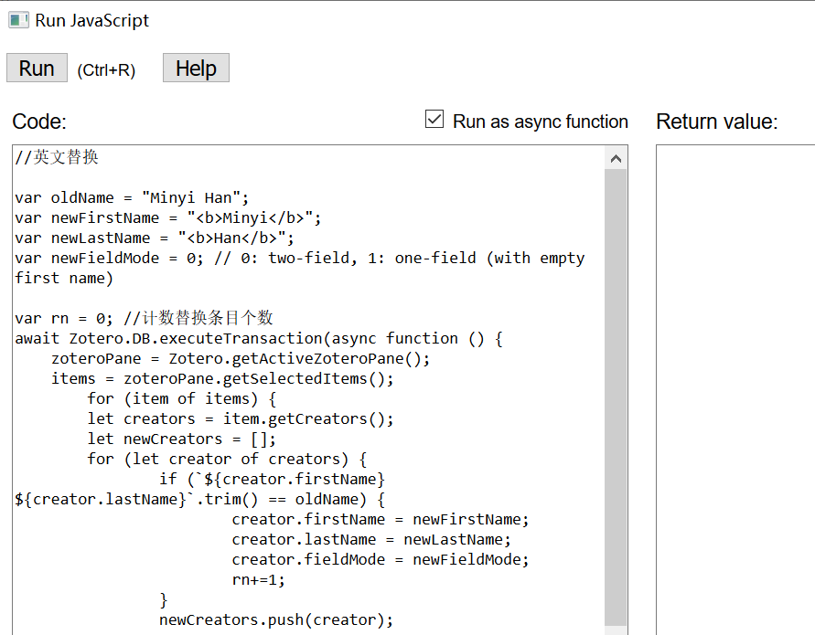

# zotero-javascripts
Some JavaScripts used in Zotero to batch process

用于批处理的一些JavaScript脚本。

* ## LICENSE
  [GPL](https://www.gnu.org/licenses/gpl-3.0.txt)

* ## 使用方法：
1.点击需要的JavaScript脚本链接，再点击`Raw`，将代码复制。

2.在Zotero中依次点击Tools-Developer-Run JavaScript，将代码复制到Code窗口，点击Run即可。如下图所示：

* ## JavaScript脚本：

* ### [1. set item language to en if this field is empty](https://github.com/redleafnew/zotero-javascripts/blob/main/1set%20item%20language%20to%20en%20if%20this%20field%20is%20empty.js)

     如果语言字段为空，批量将语言设置为en（英语）。
* ### [2. change the item title to sentence case](https://github.com/redleafnew/zotero-javascripts/blob/main/2change%20the%20item%20title%20to%20sentence%20case.js)
    将文献的题目大小写修改为句首字母大写（Sentence case）。
* ### [3. empty the extra field](https://github.com/redleafnew/zotero-javascripts/blob/main/3empty%20the%20extra%20field.js)
    将Extra字段清空。
* ### [4. delete the attachment files after the items have been removed when zotfile was installed ](https://github.com/redleafnew/zotero-javascripts/blob/main/4delete%20the%20attachment%20files%20after%20the%20items%20have%20been%20removed%20when%20zotfile%20was%20installed.js)
    清除用了[ZotFlie](http://zotfile.com)扩展后删除条目后残留的附件。使用方法见[Zotero不用安装其它软件清理删除条目后残留的PDF方法](https://zhuanlan.zhihu.com/p/356071795)。
* ### [5. delete the addachments when the items were removed](https://github.com/redleafnew/zotero-javascripts/blob/main/5delete%20the%20addachments%20when%20the%20items%20were%20removed.js)
    删除条目的同时删除附件（在安装了[ZotFlie](http://zotfile.com)扩展后很有用）。
* ### [6. change the authors case to title case](https://github.com/redleafnew/zotero-javascripts/blob/main/6change%20the%20authors%20case%20to%20title%20case.js)
    将作者大小写修改词首字母大写，使用方法见[Zotero作者姓名批量修改为首字母大写](https://zhuanlan.zhihu.com/p/354481222)。
* ### [7. batch merge duplicates](https://github.com/redleafnew/zotero-javascripts/blob/main/7batch%20merge%20duplicates.js)
    批量删除（合并）重复文献，使用方法见[Zotero批量删除（合并）重复文献](https://zhuanlan.zhihu.com/p/352324486)。

* ### [8. back up profile and data](https://github.com/redleafnew/zotero-javascripts/blob/main/8back%20up%20profile%20and%20data.js)
    备份配置和数据。使用方法见[Zotero利用JavaScript备份配置和数据](https://zhuanlan.zhihu.com/p/357859432)。

* ### [9. delete item(s) snapshots.js](https://github.com/redleafnew/zotero-javascripts/blob/main/9delete%20item(s)%20snapshots.js)。
    删除所选条目的快照，包括贮存的本地文件。
    
更多Zotero的使用方法见[Chinese-STD-GB-T-7714-related-csl](https://github.com/redleafnew/Chinese-std-GB-T-7714-related-csl)，Zotero的使用教程见[Zotero_introduction](https://github.com/redleafnew/Zotero_introduction)。
